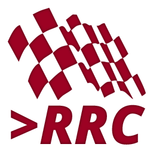

# Raceroom Commander
Created by Koen van Hove - koenvh.nl

Raceroom Commander is a small script that adds support for chat commands in Raceroom.
It can also set custom rules regarding minimum rating/reputation with whitelist.

## Commands:
- /kick NAME - Kicks a player from the server
- /ban NAME - Bans a player from the server
- /penalty NAME TYPE - Penalise a player, either slowdown, drivethrough, stopandgo, or disqualify
- /slowdown NAME DURATION - Give a slowdown penalty to a player for DURATION seconds
- /drivethrough NAME - Give a drive-through penalty to a player
- /stopandgo NAME - Give a stop-and-go penalty to a player
- /disqualify NAME - Black flag a player
- /next - Continue to the next session
- /restart - Restart the current session
- /help - Show the available commands

## How it works:
Edit the `server.json` file. Add your own ID to the `admin_ids` list. 
You can find your ID in the dedicated server web page, under current users next to your name.
The users in this list have access to the commands above. 
If they are in the game, and they type one of the commands, then Raceroom Commander will pick that up.
If you set a `minimum_rating` and/or `minimum_reputation`, then the server will kick players that 
attempt to join the server with an insufficient rating/reputation. Set this to -1 to disable.
The IDs in the `whitelist_ids` list will never be kicked due to insufficient rating/reputation.